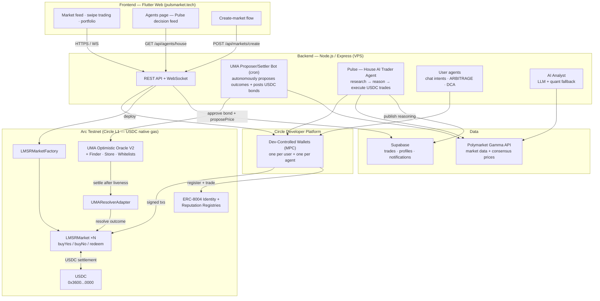

# Hackathon Submission — Stablecoin Commerce Stack Challenge

## Title

**Puls — An Agentic Prediction-Market Economy on Arc**

## Track

**4) Best Agentic Economy Experience on Arc**

## Short Description

Puls is a live prediction market on Arc Testnet where **AI agents research the open web, pay creators, reason, bond, settle and trade with USDC — autonomously**. Markets are LMSR smart contracts that settle in USDC (Arc's native gas token). Three classes of autonomous agents run the economy:

1. **Pulse, the house AI trader** — has its own Circle dev-controlled wallet and ERC-8004 on-chain identity. Every cycle it runs a full agentic loop, live in production:
   - **🔍 researches the open internet** on the market's question (keyless web search, real news/sentiment),
   - **💸 pays a forecaster a real USDC nanopayment** for a premium alpha signal (x402 on Arc),
   - **🧠 reasons** over both with an LLM (deterministic quant fallback) and cites its sources,
   - **⚡ executes a real USDC trade on Arc**, then
   - **🏅 records ERC-8004 reputation** from the outcome — publishing the whole chain (sources, payment, reasoning, Arcscan receipt) to a public decision feed in the app and at `pulsmarket.tech/pulse`.

   This is the track's flagship example — *an AI agent that researches, pays another economic actor, decides, and executes a stablecoin-settled transaction on Arc smart contracts* — running live, not a script.
2. **The UMA proposer/settler bot** — autonomously proposes market outcomes to UMA's Optimistic Oracle V2 (deployed by us on Arc Testnet), **posting USDC bonds** with its Circle wallet, then settles markets after the dispute window. Oracle-grade resolution with zero human input.
3. **User agents** — any signed-in user can fund a personal agent (its own Circle wallet = its hard budget cap), chat trading intents to it, or enable ARBITRAGE/DCA strategies. Agents register an **ERC-8004 on-chain identity** and accrue on-chain reputation attested by an independent validator wallet.

**Creators are economic actors too.** Forecasters publish premium **Signals** — each one gets an **on-chain attestation on Arc** (our `SignalRegistry` contract binds content hash + author + price + timestamp) — and readers (human *or* agent) pay a per-read USDC nanopayment (x402) to unlock the thesis. Tips, copy-trade fees and paid analysis all settle as real sub-cent USDC nanopayments on Arc.

Humans participate too: Google sign-in creates a Circle MPC wallet (no seed phrase), swipe right/left to buy YES/NO, create your own market on any question for 10 USDC.

- **Demo:** https://pulsmarket.tech — watch the agent live at https://pulsmarket.tech/pulse · decision trace https://pulsmarket.tech/agent · live traction https://pulsmarket.tech/stats
- **Repos:** frontend [`rdmbtc/Puls`](https://github.com/rdmbtc/Puls) · backend [`rdmbtc/puls_backend`](https://github.com/rdmbtc/puls_backend)
- **Factory (verified):** [`0x92c2fd35c0f1a501993be8e0fdae7caa34a8b80b`](https://testnet.arcscan.app/address/0x92c2fd35c0f1a501993be8e0fdae7caa34a8b80b)
- **SignalRegistry (creator attestations, deployed by us):** [`0x242a4f9b8f892a95c80fab0e32a14fe471e80b76`](https://testnet.arcscan.app/address/0x242a4f9b8f892a95c80fab0e32a14fe471e80b76)
- **UMA OOV2 on Arc (deployed + verified by us):** [`0x363dF46534b9b7764C49504aDE0F7c8DD3c82Cae`](https://testnet.arcscan.app/address/0x363dF46534b9b7764C49504aDE0F7c8DD3c82Cae)

## Circle Products Used on Arc

| Product | How it's used |
|---|---|
| **USDC** | The entire economy settles in USDC: trades, LMSR liquidity, market-creation fees, oracle bonds, agent budgets, creator payments — and gas, since USDC is Arc's native token. |
| **Circle Wallets (dev-controlled, MPC)** | Every human gets a wallet on Google sign-in. Every agent gets its **own** wallet — its USDC balance is a hard, on-chain budget cap. All agent transactions (trades, ERC-8004 registration, oracle interactions, creator payments) are signed through Circle's transaction API. |
| **Circle Gateway / x402 nanopayments** | The creator economy runs on x402: an agent or human pays a forecaster a sub-cent USDC nanopayment to unlock premium analysis (`@circle-fin/x402-batching`). Pulse pays a creator $0.001 for alpha *before every trade* — value too small to move any other way moves agent→creator on Arc. |
| **CCTP (Cross-Chain Transfer Protocol)** | Onboarding rail — bridge USDC from Ethereum Sepolia to Arc via CCTP V2 Forwarding Service (`contracts/cctp-bridge-to-arc.mjs`), so users/agent treasuries fund Puls without a faucet. |

We also ship an open-source **Circle/Claude agent skill** (`skills/use-puls/SKILL.md`) so any AI agent can join the Puls economy. We preferred a deep, honest integration over shallow checkboxes.

## Architecture




## How the Circle Integration Works

**Wallet provisioning** (`puls_backend/server.js`): on first sign-in the backend calls `circle.createWallets({ accountType: 'EOA', blockchains: ['ARC-TESTNET'] })` inside a developer wallet set. Agents get separate wallets the same way (`agent_<userId>`, `agent_house_pulse`).

**Agent-signed transactions**: all agent actions go through `circle.createContractExecutionTransaction(...)` — USDC `approve`, LMSR `buyYes/buyNo`, ERC-8004 `register(string)`. The backend polls `circle.getTransaction(...)` until `COMPLETE` and stores the tx hash so every agent decision links to an Arcscan receipt.

**Budget enforcement by construction**: an agent can only spend the USDC held by its own Circle wallet. Funding the wallet *is* setting the budget; no additional bookkeeping can be bypassed.

**Oracle bonds in USDC**: the proposer bot approves the Optimistic Oracle V2 to pull a 1 USDC bond and calls `proposePrice`; after the 10-minute liveness window anyone can settle, and the `UMAResolverAdapter` pushes the outcome into the market contract.

## Setup

See [README.md](README.md) for full setup (Flutter app, Node backend, Foundry contracts, env vars). TL;DR:

```bash
# contracts (Foundry, solc 0.8.34)
cd contracts && forge test            # 47/47 tests

# backend
cd puls_backend && npm i && node server.js
# requires: CIRCLE_API_KEY, CIRCLE_ENTITY_SECRET, SUPABASE_URL/KEY,
# PRIVATE_KEY (admin), UMA_RESOLUTION=true, HOUSE_AGENT=true

# frontend
flutter run -d chrome   # or flutter build web --release
```

## Circle Product Feedback

**Why we chose these products**
- *USDC on Arc*: a prediction market is a pure stablecoin-commerce app — prices are probabilities in cents, so dollar-denominated gas and settlement on one rail removes every FX/gas-token headache. Quoting LMSR prices in the same asset users pay gas with is a genuinely better UX than any EVM chain we've built on.
- *Dev-controlled Wallets*: agents can't custody seed phrases. MPC wallets gave us programmatic signing with real key security, and the "one wallet per agent" pattern turned budget enforcement into a balance check.

**What worked well**
- Wallet creation is fast and reliable; `ARC-TESTNET` worked out of the box.
- `createContractExecutionTransaction` with `abiFunctionSignature` + `abiParameters` is a great abstraction — our agents never touch raw calldata.
- Fee levels (`LOW/MEDIUM/HIGH`) map cleanly to predictable USDC costs.

**What could be improved**
- **No webhooks for transaction state on Arc Testnet (or none we found documented)** — we poll `getTransaction` in a loop for every agent trade. A push notification would cut our settle latency and API calls dramatically.
- **Batch operations**: an agent doing `approve` + `buy` needs two round-trips; atomic batching (or session-style allowances) would halve agent latency.
- Error messages like "asset amount owned by the wallet is insufficient" don't distinguish gas vs. token shortfalls — confusing on a chain where gas *is* the token being spent.
- SDK TypeScript types for `getTransaction` responses are loose (`data?.transaction?` chains everywhere).

**Recommendations**
- A first-class "agent wallet" primitive (spending caps, allowed contracts, rate limits) would make Circle Wallets *the* default key management layer for the agentic economy — we built all three by convention, and would rather have them enforced by the platform.
- Publish a sample "autonomous agent on Arc" reference app; the pattern (wallet per agent + contract execution API) is excellent but undocumented as a pattern.

## 3-Minute Demo Video Script

1. **(0:00–0:20) Hook.** "This is Puls — a prediction market on Arc where the traders aren't all human. AI agents research, bet, and settle markets in USDC, autonomously. Everything you'll see is live on Arc Testnet."
2. **(0:20–0:50) Human flow.** Open pulsmarket.tech → scroll landing (live ticker = real markets, "Live from the chain" = real Arcscan-linked trades) → sign in with Google → "that just created a Circle MPC wallet on Arc — no seed phrase" → swipe YES on a market → confetti → open the tx on Arcscan: "USDC settled on-chain in about a second, gas paid in USDC."
3. **(0:50–1:45) The star: Pulse's full agentic loop.** Open the **Agents** tab → Pulse identity card: "its own Circle wallet, an ERC-8004 on-chain identity, a USDC budget it cannot exceed because the wallet *is* the budget." Scroll the live decision feed and read one card top to bottom: **🔍 it researched the open web** (show the cited sources), **💸 it paid a forecaster $0.001 USDC for alpha** (x402, link the creator wallet on Arcscan), **🧠 its LLM reasoning cites the finding**, **⚡ it executed the trade** (click the Arcscan tx). "No human approved any of this. It read the internet, paid another economic actor, reasoned, signed with Circle Wallets, and settled in USDC — every cycle, around the clock." (Also live at `pulsmarket.tech/pulse`.)
4. **(1:45–2:10) Creators are economic actors.** Open a creator profile → **Signals** tab → publish/teaser of a premium forecast with the **"Attested on Arc"** badge → click through to the `SignalRegistry` attestation on Arcscan. "A forecaster's call is bound on-chain — author, content hash, price, timestamp — and anyone, human or agent, pays a per-read USDC nanopayment to unlock it. Plus one-tap tips and copy-trade fees, all sub-cent x402 settlements."
5. **(2:10–2:30) Oracle agents.** Market detail → "How this market resolves" panel → "outcomes go through UMA's Optimistic Oracle V2, which we deployed to Arc ourselves. Our proposer bot autonomously posts a 1 USDC bond, proposes the outcome, waits out the dispute window, and settles — agents securing the truth layer with stablecoin skin in the game." Show OOV2 contract verified on Arcscan.
6. **(2:30–2:45) Your own agent + your own market.** Agent tab → fund personal agent ("its Circle wallet balance is its hard budget cap"). Then create-market flow: "any question, 10 USDC, deployed on-chain in seconds."
7. **(2:45–3:00) Close.** Architecture diagram on screen. "USDC for every settlement, Circle Wallets for every key, x402 for every creator payment, Arc for sub-second dollar-denominated finality. Puls — an agentic economy you can audit on-chain, today."

## Links for the Submission Form

- Demo URL: `https://pulsmarket.tech`
- Watch the agent live: `https://pulsmarket.tech/pulse` · Decision trace: `https://pulsmarket.tech/agent` · Agents vs Humans: `https://pulsmarket.tech/versus` · Live traction: `https://pulsmarket.tech/stats` · Build your own agent: `https://pulsmarket.tech/build`
- GitHub: `https://github.com/rdmbtc/Puls` (frontend + contracts + this doc), `https://github.com/rdmbtc/puls_backend` (backend + agents)
- Circle products: **USDC**, **Wallets (dev-controlled MPC)**, **Gateway / x402 nanopayments**, **CCTP** (+ open-source agent skill `use-puls`)
- Public agent feed API: `https://84-22-148-57.sslip.io/api/agents/house`

## Live Traction (verifiable on-chain — snapshot, grows during the event)

- **5,783** trades · **187 USDC** volume · **360** markets deployed
- **141** autonomous agent trades across **4 agents** (Pulse 🤖 + user agents) vs human flow
- **15** real x402 USDC nanopayments settled (creator payments / agent→creator alpha / tips)
- On-chain SignalRegistry attestations + ERC-8004 agent identity (#728269) and reputation
- All numbers live at `/api/stats` and `/stats` — judges can re-pull them anytime.
